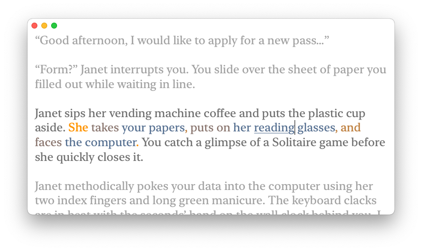
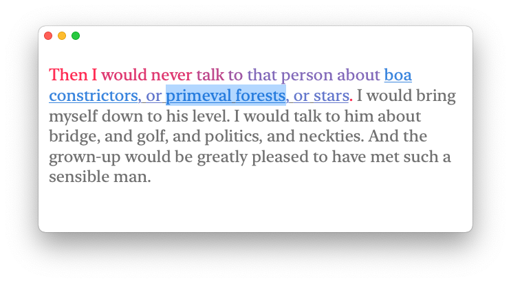

# Introduction

Most text editing interface in use today derives from the Gypsy editor developed in the 1970s, where text is selected by dragging the mouse [@tesler2012personal].

Modern operating systems offer additional shortcuts to aid with selection, such as double-clicking to select a word and triple-clicking to select a paragraph.

However, for any other type of selection, the user has to rely extensively on a pointing device or the keyboard arrow cluster. Consider the following passage, where the user selection is shown in grey:

> I rode my bike one last time though the maze of small \hl{streets} and alleys, stopped beside the waffle shop, and flipped the kickstand. 

Suppose we want to select the phrase \hl{the maze of small streets and alleys}. This can be done in one of two ways:

- Using the keyboard, move the cursor to the beginning of the desired selection, and, using the \keys{\shift+\arrowkeyright} keys, select to the end.
- Using the mouse, move the cursor to the start of the selection, press the left button, and drag to the end of the selection, and release.

With either method, it is possible to miss or add an extra character, and create selections such as \hl{he maze of small streets and alleys, }.


## Hierarchial structure within sentences

Natural text has underlying hierarchical structure. In linguistics, semantically coherent groupings are referred to as "constituents" [@LanguageFiles]. In the sentence above, the selection \hl{streets} is contained in multiple constituents:

- "small streets"
- "small streets and alleys"
- "the maze of small streets and alleys"

Determining whether a string of words constitutes a constituent can be done using constituency test. One such test is substitution: constituents can often be replaced by a single word with the same meaning. For example, the last constituent in the list above ("the maze of small streets and alleys") can be replaced with the noun "campus", to form the sentence "I rode my bike one last time through _campus_, stopped beside\ldots"

Observe that the current selection (\hl{streets}) is already contained within the desired final selection. Moreover, the desired selection happens to form a _constituent_ in the syntax tree of the sentence. We speculate that the majority of selection the user makes in a text are in fact constituents: single words in a sentence, a complete sentence, or smaller groupings in-between. We propose several user interactions to exploit that structure, described in [@sec:interaction].

## Previous work

Some operating systems such as macOS have the notion of different granularities when selecting text. Double clicking on a word in a text field selects the word and sets the granularity to _word selection_, and thus subsequent clicks while holding the \keys{\shift} key will expand the selection to include the word under the cursor. The `NSTextView` component, which forms the basis for all text fields in macOS, has three such granularities: selection by characters (default), selection by words (activated with a double click), and selection by paragraphs (activated with a triple click) [@SelectionGranularity].

Modal code editors like `vim` and `kakoune` support selecting so-called _"text objects"_, such as a line of code, or characters enclosed between delimiters such as _"`(`"_ and _"`)`"_ [@vimobject][@kakoune]. More recently, `tree-sitter`[@atom_treesitter] has been used alongside such editors to parse the code being edited and provide more intelligent selections.


However, the approach taken in modal text editors does not translate well to editing natural language:

- Natural language is not as structured as source code, and cannot be parsed as easily in real time. Punctuation alone is not enough to delimit sentences.
- The keyboard shortcuts for creating such selections are not discoverable by the average user.

Parsing of natural language is can be realised through the use of _constituency parsers_ and _dependency parsers_. Such parsers exist for various languages and can reach parsing speeds up to hundreds of sentences in a second on consumer hardware (See [@sec:parser]).


# Implementation

## Overview

We implement a simple text editor consisting of a single text field. Certain behaviours of the text field have been overriden to provide interactions for selecting constituents (see [@sec:interaction]), and text is highlighted to show its hierarchical structure and to bring focus to the sentence that's being edited.



The editor is implemented in two layers: a _back end_, which handles parsing, and a _front end_, which presents text and handles user input.

## Front end

We chose to implement the application as an AppKit application for macOS due to the author's familiarity with Swift. The text field is subclass of `NSTextView` that calls the parser whenever the texts has been changed.

## Back end

### Choice of parser {#sec:parser}

We use an existing implementation with a pretrained model for a constituncy parser.
We experimented with a few constituency parsers for this application.

#### Stanford CoreNLP

First, we looked into Stanford's CoreNLP package, which is a Java program that can run as a server locally on the user's computer. It encodes results in a protobuffer, and we were able to easily create an API for CoreNLP in Swift (See [@SwiftCoreNLP]).

CoreNLP also outputs offsets for teach token in the input text, which makes it easy to parse the parse to the original document.

However, the PCFG Parser included in CoreNLP [@pcfg] is relatively archaic compared to the rest of the package, and proved too slow for this application. While CoreNLP does support a newer, neural network parser [@stanfordShiftReduce], we did not experiment further with that.

#### Berkeley Neural Parser

Berkeley's neural network parser [@berkeleyNeural] (Benepar) uses neural networks and runs in near-linear time. Generating a parse is a simple function call in python:

```python
parser = spacy.load('en_core_web_md')
parser.add_pipe("benepar", config={"model": "benepar_en3"})
# ...
parse = parser("Benepar can parse untokenized text consisting of
                multiple sentences")
```

Being able to parse a raw string consisting of many sentences is a requirement for this application. However, in our testing Benepar did not always succeed in splitting the text into sentences, as seen in [@fig:benepar-wlh]. Note that the parse in the figure is gramatically correct, but less probable.

\begin{figure}[h!]
\begin{adjustwidth}{-2cm}{-2cm}
\begin{center}
\scalebox{.8}{\input{./parses/tex/wlh_benepar.tex} }
\end{center}
\end{adjustwidth}
\caption {BENEPAR's parse for \emph{"I went to W.L.H. There, I studied\ldots"}. Note how \emph{"W.L.H. There"} gets parsed as one entity, which breaks sentence segmentation.}
\label{fig:benepar-wlh}
\end{figure}

#### CRF Parser

We ultimately settled on using the reference implementation for the _SuPar_ parser. [@crfParser] It outperforms Benepar [@berkeleyNeural] in terms of parsing speed and accuracy. The SuPar parser does however not accept raw text input, and as such, we need to tokenize the text and split it into sentences. That task is easily accomplished using NLTK:

```python
import nltk, supar
parser = supar.Parser.load('crf-con-en')
sents  = nltk.sent_tokenize('The CRF parser needs pre-tokenized input.')
tokens = [nltk.word_tokenize(x) for x in sents]
parses = parser.predict(tokens).sentences
```
The combination of NLTK and SuPar produces the output we expect, as seen in [@fig:crf-wlh].

\begin{figure}[h!]
\begin{adjustwidth}{-2cm}{-2cm}
\begin{center}
\scalebox{.8}{
\input{./parses/tex/wlh_crf_pretokenized.tex}
}
\end{center}
\end{adjustwidth}
\caption {SuPar's parse for \emph{"I went to W.L.H. There, I studied\ldots"}.}
\label{fig:crf-wlh}
\end{figure}

### Parse postprocessing

Sometimes, there are multiple correct parses for a single input, and it is useful to convert the parse tree to a standartized form that is more intuitive for the user. We observed that when listing items composed of noun phrases, provided that the noun phrases have a certain number of descendant constituents, the CRF parser groups every few noun phrases as one, producing deeply nested trees as shown in [@fig:nested].

\input{./fig/flattree.tex}

## Interfacing with the parser

The backend implementation is located in `Sources/Backend`.

In order to facilitate communication between Swift and the `SuPar` Python package, we use the `PythonKit` swift package [@PythonKit] to dynamically load a Python interpreter. Then, we use the interpreter to load the Python module at `Sources/Backend/supar_bridge.py`, which imports the `SuPar` parser and wraps it into a function that's easy for Swift to understand.

The frontend waits for changes in the text and parses it in a Combine [@Combine] pipe:
```swift
NotificationCenter.default
    // Listen for text changes
    .publisher(for: NSText.didChangeNotification, object: self)
    // Wait so the language server is not overwhelmed
    .debounce(for: .milliseconds(50), scheduler: DispatchQueue.main)
    .compactMap { ($0.object as? NSText)?.string }
    // Don't parse if the text hasn't changed since last parse
    .filter { $0.hashValue != self.parse?.hash }
    // Parse
    .flatMap { NLPServer.parse($0) }
    // Sometimes, we receive parses for outdated text. Checking the hash suffices to
    // prevent crashes when highlighting
    .filter { self.textStorage?.string.hashValue == $0.hash }
    // Update state
    .receive(on: DispatchQueue.main)
    .sink { _ in
    } receiveValue: { tree in
        self.parse = tree
        self.highlight()
    }
    .store(in: &self.subscription)
```

# User interactions {#sec:interaction}

We implement a few commands for creating selections as described below. All resulting selections shown in this section are based on the text and selection shown in [@fig:littleprince]




- **Expand selection**: Selects the smallest constituent that fully contains the current selection. In this example, expanding would select the noun phrase \texthl{boa constrictors, or primeval forests, or stars}.
- **Refine selection**: Opposite of "Expand selection" -- selects a constituent that is a descendant of the currently selected constituent. In the example, that could be \texthl{primeval} or \texthl{forests}. Normally, the most recently selected descendant will be chosen such that this operation negates "Expand selection". When using the mouse, the descendant closest to the mouse cursor will be chosen.
- **Select enclosing sentence**: Selects the sentence that contains the cursor or the current selection. In the example, this expands the selection to the first sentence: \texthl{Then I would never talk to that person about boa constrictors, or primeval forests, or stars.}
- **Select neighbour**: Selects either of the neighbouring constituents with the same depth. In this example, repeatedly selecting the left neghbour would yield \texthl{or}, \texthl{,}, \texthl{boa constrictors}.
- **Augment selection**: Appends either of the neighbouring constituents with the same depth to the sellection, or subtracts a children constituent form the selection. In this example, expanding to the right would yield \texthl{primeval forests,}, \texthl{primeval forests, or}, \texthl{primeval forests, or boa constrictors}.

## Keybindings and gestures

| Command                | Keybinding                   | Mouse gesture |
|------------------------|------------------------------|-------------------------------------------------|
| Expand selection       | \keys{\Alt + \arrowkeyup}    | Pinch out on trakpad, or hold tertiary mouse button and scroll up                     |
| Select sentence        | \keys{\cmd + \Alt + S}       | Triple click     |
| Select paragraph       |                              | Quadruple click  |
| Refine selection       | \keys{\Alt + \arrowkeydown}  | Pinch in on trackpad, or hold tetriary mouse button and scroll down                   |
| Select neighbour  | \keys{\Alt + \arrowkeyleft} \keys{\arrowkeyright}  | Hold tertiary mouse button and move cursor |
| Augment selection  | \keys{\shift + \Alt+ \arrowkeyleft} \keys{\arrowkeyright}  |  Hold \keys{\shift + \Alt} and click on text |

All of the above commands are exposed as keyboard shortcuts as shown it the table above. We chose the \keys{\Alt + \arrowkeyright} \keys{\arrowkeydown} \keys{\arrowkeyleft} \keys{\arrowkeyup} shortcuts since they are reminiscent of Atom's bindings for treesitter navigation [@atom_treesitter].

The shortcuts for augmenting selection \keys{\shift + \Alt+ \arrowkeyleft} \keys{\arrowkeyright} function differently depending on the selection's "direction". If a selection was initially made by dragging the mouse left to right, \keys{\shift + \Alt+ \arrowkeyright} expands at the right end, and \keys{\shift + \Alt+ \arrowkeyleft} trims it at the right end.

A triple click was designated to select the sentence under the cursor. This shortcut is already familiar to users for selecting paragraphs in text fields. The default paragraph selection feature has been reassigned to a quadruple click.

On the trackpad, a "zoom-in" gesture by placing two fingers expands the selection, and a "zoom-out" gesture refines it. These gestures are geneally associated with making objects larger or smaller, and in this case they are lengthening or shortening the selection.

To access commands with a mouse, the tetriary button must be held down. That button is usually the scroll wheel itself. While the mouse is dragged with the tetriary button, the selection changes to match the constituent directly under the mouse cursor.


# Syntax highlighting {#sec:highlighting}

To better inform the user of the structure of the text, we highlight words in different colours depending on how deep they are embedded in a sentence. Observe that in [@fig:janet] the subject of the sentence (_"She"_) is highlighted in orange, as it is embedded close to the sentence root. The objects in the verb phrases are embedded deepest, and are thus highlighted in blue.

Syntax highlighting is not completely foreign to word processors. iA Writer is capable of highlighting parts of speech (POS) in different colours (see [@fig:highlightingiawriter].) In the author's experience, this sometimes leads to visual clutter and does not intuitively reflect the structure of the sentence. Observe that using our highlighting in [@fig:highlightingours], the phrases secondary to the meaning are highlighted in a more dull colour, which helps skim-read the sentences as _"I bought oranges, bananas"_. Meanwhile, in [@fig:highlightingiawriter] attention is brought to all verbs: _"bought"_, _"will use"_, _"make"_, _"make"_.

\begin{figure}[h!]
\subfloat[POS highlighting in \emph{iA Writer}]{
\includegraphics{./fig/highlightingiawriter.png}%
\label{fig:highlightingiawriter}
}

\subfloat[Depth highlighting in our editor]{
\includegraphics{./fig/highlightingours.png}%
\label{fig:highlightingours}
}
\caption {A same sentence highlighted in iA Writer and our editor}
\label{fig:highlighting}
\end{figure}

To reduce clutter, highlighting is only displayed for the currently selected sentence. Moreover, paragraphs other than the one containing the cursor are faded out to bring focus to the cursor, akin to _iA Writer_'s "Focus" feature. 

To help the user make selections, we underline the constituent that contains the user selection. The underlined text is what would get selected with the "Expand selection" command.

We provide a few colour schemes to choose from in the \menu{View>Colourschemes} menu. Additional colour schemes can be defined in the `colorSchemes` dictionary in `Sources/Frontend/Highlighting.swift`, and they will be automatically listed in the menu.

# Results and Future Work

We developed a simple word processor with additional interactions for selecting common phrases in natural text. Executable source code for the project is available at <https://github.com/hristost/CPSC490-SemanticSelections-Implementation> [^pandoc]. Consult the `README` file in the repository for instructions on how to run.

[^pandoc]: Additionally, the  Markdown / \LaTeX  source for this PDF can be found at <https://github.com/hristost/CPSC490-SemanticSelections-Report>

We presented the finished word processor to five users, and gathered the following verbal feedback:

- The triple-click gesture to select a sentence is particularly useful.
- The multitouch trackpad gestures are intuitive, and users could see themselves using that selection method after more practice.
- The phrases selected by our word processor are useful for editing and copying text.
- One user said that the syntax highlighting brings attention to subjects and important parts of sentences, and another user commented that they were able to skim text faster than usual. The latter also concurred that the colours made it easy to spot superfluous passages that could be redacted while editing.
- When comparing to iA Writer, one user found iA Writer's POS highlighting more natural, while the others sided with our proposed constituent highlighting. Nevertheless, one of them shared that although they find POS highlighting cluttered and too granular, it might be useful to have that information in some cases.
 
## Future work

There is a lot more work to be done this approach to be usable in everyday work. Firstly, more accurate parsing and preprocessing is needed. In the sample text bundled with the source code, NLTK mistakengly merges two sentences as one when the former ends in a quotemark. On occassions, SuPar would produce possible but highly improbable parses. In the following sentence, the highlighted text denotes a complete constituent according to SuPar:

> I bought oranges that I will use to make juice, bananas that I will use for \texthl{banana bread, and milk}.

Although this parse is not incorrect per se, (it is grammatically possible that we use bananas to make milk,) it is unlikely, especially given the Oxford comma before "and". Prepending _"some"_ before _"milk"_ fixes the parsing.

It is worth gathering more data on such edge cases, and researching which parsers fare best.

### Incremental parsing

Currently, text is re-parsed on every edit, which leads to a perceivable lag with longer passages. We can instead choose to only parse the sentences being edited, and merge the result in the existing parse tree.

### Language support

This type of work should not be restricted but just English language text. As long as a constituency parser exists for a given language, this word processor can be modified to work with it.

Currently, the word processor only supports English text. Very limited support for Chinese is implemented thanks to SuPar's Chinese constituency parsing model. Parsing in Chinese can be activated using the \menu{Edit>Languages>Chinese} menu. Currently, it uses the _JieBa_ python package [@jieba] to tokenize text, and is limited to parsing a single sentence. 


\begin{CJK*}{UTF8}{gbsn}
We found that the proposed interactions and text highlighting work just as well as in English text, as shown in \autoref{@fig:chinese}. However, the combination of the JieBa tokenizer and SupPar's model proved unreliable. Substituting the last word "精神" for "神奇" yields a very different parse structure, even though both words are used as noun phrases in this context.
\end{CJK*} 
### Tokenizing and parsing of structured text

Sometimes, natural language text has bits of structured text in it, such as URLs and phone numbers. Instead of these being represented as leaf nodes in the syntax tree, they can be tokenized and parsed separately to allow the user to easily select parts of them.

### Semantic selection in all text fields

Lastly, some of the interactions researched in this project, such as selecting complete sentences, are good to have in any text field presented to the user. It would be interesting to explore if it is possible to extend the text field component in a Linux GUI to have such behaviour.
